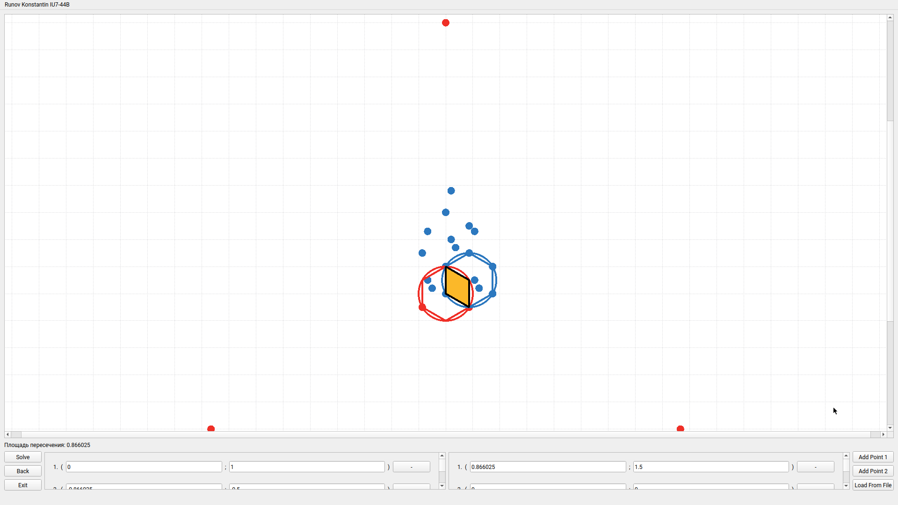

### Задача:
Заданы два множества точек на плоскости. В каждом множестве найти три равноудалѐнные друг от друга точки. Через эти точки провести окружности. В каждую окружность вписать шестиугольник. Найти площадь пересечения двух получившихся шестиугольников.

### Видео с демонстрацией:

